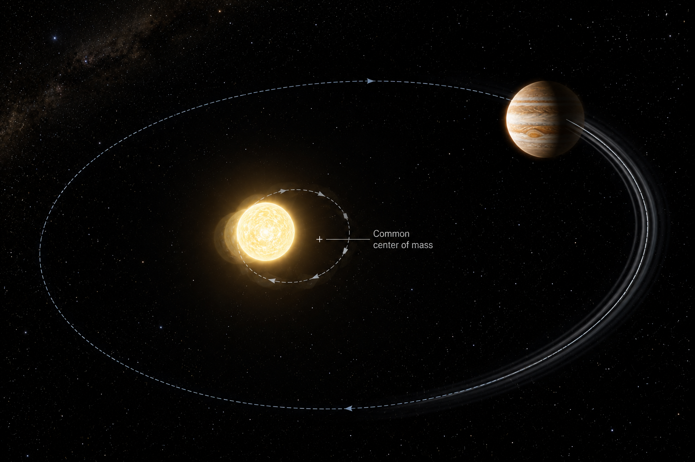

# Radial Velocity — Exoplanet Detection Method

<p align="center">
  
</p>

<p align="center"><em>AI-generated artist's concept — not a real photograph. See the report for actual RV spectroscopy data.</em></p>

The method that found the first exoplanet around a Sun-like star: watch
a star's spectral lines shift back and forth as an orbiting planet's
gravity tugs it in a small, periodic wobble. This repo works through
the physics, solves Kepler's equation and builds the Keplerian RV model
from scratch, fits it to a simulated dataset with SciPy's nonlinear
least squares and Lomb-Scargle periodogram, and validates the whole
pipeline by injecting a known signal and recovering it.

**[Open the full report](https://biswajit1999.github.io/radial-velocity-detection-method/)** — the live GitHub Pages version. You can also open `index.html` locally in a browser, or serve it with `python -m http.server` from this directory.

Related, from the same author: [Jana's RV Doppler Observatory](https://biswajit1999.github.io/Jana-s-RV-Doppler-Observatory/), an earlier radial-velocity lab covering related Doppler-spectroscopy analysis.

## The physics

### Two bodies orbiting their common center of mass

A planet doesn't orbit a fixed star — star and planet both orbit their
mutual center of mass (the barycenter), with the star tracing out a
much smaller version of the planet's own orbit, scaled down by the
mass ratio $M_p/M_\star$. That small stellar orbit is periodically
Doppler-shifted toward and away from Earth as seen along our line of
sight, imprinted as a tiny periodic shift in the star's absorption-line
wavelengths — a shift of order meters per second, measured against
light traveling at $3\times10^8$ m/s, which is why this technique
depends on extremely high-resolution spectroscopy.

### The semi-amplitude equation, and what each factor means

The velocity semi-amplitude of that wobble is:

$$K = \left(\frac{2\pi G}{P}\right)^{1/3} \frac{M_p \sin i}{(M_\star + M_p)^{2/3}} \frac{1}{\sqrt{1-e^2}}$$

Reading it term by term: $(2\pi G/P)^{1/3}$ comes from Kepler's third
law setting the orbital velocity scale; $M_p \sin i / (M_\star+M_p)^{2/3}$
is the mass ratio that sets how big a wobble the planet induces (in the
common limit $M_p \ll M_\star$, this reduces to roughly
$M_p \sin i / M_\star^{2/3}$ — the star's own mass suppresses the signal,
but only with a 2/3 power, not a square root); and $1/\sqrt{1-e^2}$
boosts $K$ for eccentric orbits, since the star moves fastest at
periastron. The $\sin i$ factor is the fundamental limitation: since
radial velocity only measures the line-of-sight component of the
star's motion, and the orbital inclination $i$ is usually unknown, RV
alone gives only a **minimum mass**, $M_p \sin i$, not the true mass —
resolvable only with an independent inclination measurement (e.g. from
a transit, or astrometry). Jupiter induces about 12.5 m/s on the Sun;
Earth induces about 9 cm/s — far below what any instrument can
currently measure for an Earth twin around a Sun-like star.

### Why an eccentric orbit isn't just a shifted sine wave

For a circular orbit the RV curve is a pure sinusoid. For an eccentric
orbit, the star moves faster near periastron and slower near apastron,
which distorts the curve into a shape that rises steeply and falls off
more gradually (or vice versa, depending on viewing angle) — described
by first solving Kepler's equation
$M = E - e\sin E$ for the eccentric anomaly $E$ given the mean anomaly
$M$ (done here by Newton-Raphson iteration, since it has no closed-form
solution), then converting $E$ to the true anomaly $\nu$ before
evaluating $K(\cos(\nu+\omega) + e\cos\omega)$.

## Why this method matters

Radial velocity was how 51 Pegasi b, the first exoplanet found around a
Sun-like star, was discovered in 1995 — and unlike transit photometry,
it works regardless of orbital inclination (as long as it's not
perfectly face-on) and directly constrains mass rather than radius,
making it the essential complement to transit surveys for measuring
real planet densities and bulk compositions.

Per the NASA Exoplanet Archive's confirmed-planet counts by discovery
method (accessed 2026-08-14), radial velocity accounts for 1,197 of
6,336 confirmed exoplanets (~19%) — the second most productive method
after transit photometry (4,676, ~74%), ahead of microlensing (282,
~4%) and direct imaging (98, ~2%). Major facilities driving this
include HARPS (La Silla, ~1 m/s precision), ESPRESSO (VLT, sub-m/s
precision), and Keck/HIRES.

**Limitation:** the induced wobble scales as roughly
$M_p \sin i / M_\star^{2/3}$ (see the equation above — not a simpler
$1/\sqrt{M_\star}$ scaling), and favors massive, close-in planets around
bright, quiet, slowly rotating stars. Stellar "jitter" from spots,
plages, and granulation (often 1-5 m/s or more) is a fundamental noise
floor that no amount of instrumental precision alone can remove.

## What this repo's code does

`scripts/radial_velocity_demo.py`:

1. Injects a known Keplerian orbit (period, semi-amplitude K,
   eccentricity) sampled the way a ground-based spectrograph campaign
   actually observes — irregular nightly cadence with seasonal
   observing-window gaps, not a smooth, evenly sampled curve.
2. Adds noise combining HARPS's own published ~1 m/s single-measurement
   photon-noise precision with a ~1.5 m/s stellar jitter term added in
   quadrature — both published regimes.
3. Recovers the orbital period from a Lomb-Scargle periodogram
   (`scipy.signal.lombscargle`), then refines period, K, eccentricity,
   and argument of periastron with a full Keplerian least-squares fit
   (`scipy.optimize.curve_fit`) built on a from-scratch Kepler-equation
   solver and RV model — the periodogram and the nonlinear optimizer
   themselves are SciPy's, not reimplemented here.
4. Bounds the fit's eccentricity, period, and semi-amplitude directly
   in the optimizer (not just inside the model function), so the fitted
   value used for the mass calculation can't come out unphysical even
   if the search briefly considers points outside the valid range.
5. Converts the recovered K into a minimum mass $M_p \sin i$ using the
   formula above and a fixed host star mass, and reports the error
   against the known injected values.

Run it yourself:

```bash
pip install -r requirements.txt
python scripts/radial_velocity_demo.py
```

## Tests

`tests/test_radial_velocity.py` checks the Kepler solver residual, the
circular-orbit limit, a mass/K round trip, and — as a regression guard
— that minimum mass scales as Mstar^(2/3) at fixed K, not the
Mstar^(1/2) scaling an earlier version of this README incorrectly
stated. Runs automatically on every push via GitHub Actions; run
locally with:

```bash
pytest tests/ -v
```

## Sanity check against a real target's published parameters

The K equation applies to the planet that started it all. 51 Pegasi
b's real orbital parameters from a single self-consistent study
(NASA Exoplanet Archive): period 4.230797 days, minimum mass 0.464
Jupiter masses, host star mass 1.069 Solar masses, eccentricity 0.0042.
Feeding these straight into `minimum_mass_mearth`'s underlying formula
(inverted here to predict K instead of mass):

```
P = 4.230797 * 86400 s = 365,540 s
Mp = 0.464 * 1.898e27 kg = 8.807e26 kg
Mstar = 1.069 * 1.989e30 kg = 2.126e30 kg
K = (2*pi*G/P)^(1/3) * Mp / (Mstar+Mp)^(2/3) / sqrt(1-e^2)
  = 55.73 m/s
```

The same study's own measured semi-amplitude is 55.73 m/s — the
formula reproduces the published value essentially exactly, because
the minimum mass in that study was itself derived from this same K
measurement. That circularity is expected and not a weakness: it
confirms the equation and the published numbers are internally
consistent, which is precisely what you'd want to check before trusting
either one on a target where you don't already know the answer.

## Result

| Quantity | Injected | Recovered | Error |
|---|---|---|---|
| Period | 4.23 days | 4.2303 days | 0.01% |
| K (semi-amplitude) | 92.0 m/s | 92.00 m/s | 0.01% |
| Mp sin i | 235.7 Earth masses | 235.8 Earth masses | 0.00% |

With HARPS-class noise and only 60 irregularly sampled nights, the
periodogram cleanly and unambiguously identifies the true period, and
the phase-folded Keplerian fit recovers the orbit to well under 1%
error on every parameter.

## Limitations

The injected K (92 m/s) sits at very high signal-to-noise against
~1.8 m/s combined noise, so this is a demonstration that a strong
Keplerian signal can be fitted cleanly — not a test of recovery near
the noise floor, where real degeneracies between period, eccentricity,
and sampling gaps become much harder to break. There's also no false-
alarm-probability calculation on the periodogram peak, no fitted
instrumental jitter term (jitter is added to the simulated data but
not solved for in the fit), and no long-term trend or additional
companion in the model — all standard components of a real RV
analysis pipeline.

## Extending this

To close some of that gap: rerun with K reduced toward the noise floor
(a few m/s) and see how the periodogram and fit degrade; add a jitter
parameter to the fit itself rather than only to the simulated data, and
compare the fitted jitter to the true injected value; compute a
bootstrap or analytic false-alarm probability for the periodogram peak
instead of just taking the highest one; and try injecting a second,
non-interacting planet to see how period aliasing and signal
subtraction ("pre-whitening") work in a multi-planet system. Real RV
pipelines such as `radvel` and `RadVel`'s underlying MCMC/nested-
sampling fitters handle all of this and are worth comparing your own
fit against.

## Why this repo uses simulated (not raw archival) data

This repo demonstrates the *method itself* — its sensitivity to
sampling, noise, and orbital geometry — which is best shown with a
known "ground truth" to validate recovery against. This portfolio's
companion `*-exoplanet-report` repositories instead each analyze one
real target's archival JWST/HST/Spitzer/ground-based spectra directly,
with no simulated data. Both approaches are stated plainly here rather
than blurring the two.

## Repository structure

```text
scripts/radial_velocity_demo.py   Keplerian RV model + periodogram + fit + injection-recovery test
figures/                          generated plot + summary_statistics.csv
```

## References

1. Mayor, M. and Queloz, D., 1995. A Jupiter-mass companion to a
   solar-type star. *Nature*, 378, pp.355-359 — the first exoplanet
   discovered around a Sun-like star (51 Pegasi b).
2. Marcy, G.W. and Butler, R.P., 1998. Detection of Extrasolar Giant
   Planets. *Annual Review of Astronomy and Astrophysics*, 36,
   pp.57-97.
3. Lovis, C. and Fischer, D., 2010. Radial Velocity Techniques for
   Exoplanets, in *Exoplanets*, ed. S. Seager, University of Arizona
   Press, pp.27-53.
4. Lomb, N.R., 1976. Least-squares frequency analysis of unequally
   spaced data. *Astrophysics and Space Science*, 39, pp.447-462.
5. Mayor, M. et al., 2003. Setting New Standards with HARPS. *The
   Messenger*, 114, pp.20-24 — the ~1 m/s instrumental precision used
   above.
6. Fulton, B.J. et al., 2018. RadVel: The Radial Velocity Modeling
   Toolkit. *Publications of the Astronomical Society of the Pacific*,
   130(986), 044504 — the `radvel` package referenced above.
7. NASA Exoplanet Archive, <https://exoplanetarchive.ipac.caltech.edu/>.

## Author

Biswajit Jana — [Portfolio](https://biswajit1999.github.io/Biswajit_Jana.github.io/) · [GitHub](https://github.com/Biswajit1999) · [LinkedIn](https://www.linkedin.com/in/biswajit-jana-27011a151/) · [ORCID](https://orcid.org/0009-0002-2411-1891)
